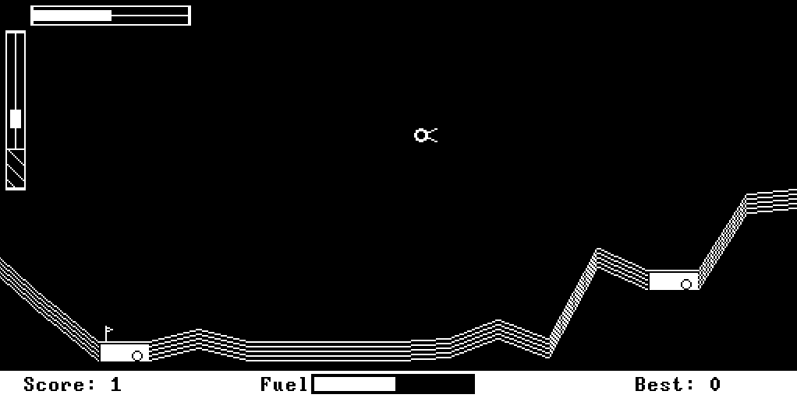

# Martian Lander
## A game for the Hack computer architecture.

A simple Lunar Lander style game written in the Jack language for the Hack computer, part of the [Nand to Tetris](https://www.nand2tetris.org) course.

Includes a pseudorandom number generation class based on a simplified [Wichmann-Hill](https://en.wikipedia.org/wiki/Wichmann–Hill) implementation.
